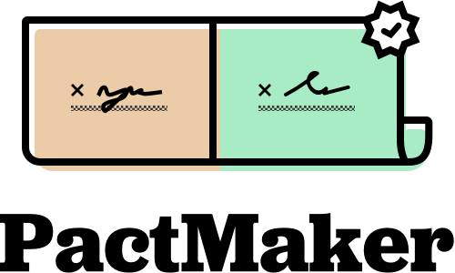

<h1 align="center">
  
  <br>
  <br>
</h1>

>Starter workflow for creating self-signed PDF agreements. If you’re working on becoming GDPR compliant, we wrote a [quick guide](https://postmarkapp.com/blog/gdpr-get-ready) on how you can get prepared.


[](https://heroku.com/deploy)

PactMaker spins up a website with a form that lets your customers self-sign PDF agreements. After each agreement is signed, it sends an email with a copy of the PDF using [Postmark](https://postmarkapp.com). PactMaker is built with node.js, express, and EJS templating.


## Configuration
Create an environment variable file(`.env`) in the project root with the following variables:

```
POSTMARK_SERVER_TOKEN=''
POSTMARK_FROM_ADDRESS=''
INTERNAL_EMAIL_RECIPIENTS=''
INTERNAL_EMAIL_SUBJECT=''
SIGNEE_EMAIL_SUBJECT=''
TITLE=''
```

#### `POSTMARK_SERVER_TOKEN`
Server tokens can be found under the credentials tab on your Postmark server.

#### `POSTMARK_FROM_ADDRESS`
The email address you want to send the email from. You must verify your domain or create a valid Sender Signature on Postmark.

#### `INTERNAL_EMAIL_RECIPIENTS`
Comma-separated list of email address you want to send the PDF agreement to.

#### `INTERNAL_EMAIL_SUBJECT`
The subject line of the email that gets sent to your team. Available variables: `<%= company %>`, `<%= name %>`, `<%= role %>`, and `<%= email %>`.

#### `SIGNEE_EMAIL_SUBJECT`
The subject line of the email that gets sent to the person who just signed the agreement. Available variables: `<%= company %>`, `<%= name %>`, `<%= role %>`, and `<%= email %>`.

#### `TITLE`
The name of your company or app. This will appear on the page header and footer.

## Get started
Before you get started, make sure you have an environment variable file(see above) and that [Node.js](https://nodejs.org/en/) and [npm](https://www.npmjs.com/get-npm) is installed.

* In terminal, run `npm install`
* Run `npm start` or `heroku local` to run the project locally
* By default, `npm start` uses [port 3000](http://localhost:3000) and `heroku local` uses [port 5000](http://localhost:5000).

## Email templates
The email content for the signee and internal email can be found under [`/emails`](emails). Templates are rendered using [EJS](http://www.embeddedjs.com/). Available variables: `<%= company %>`, `<%= name %>`, `<%= role %>`, and `<%= email %>`.

## Agreement template
The agreement PDF template can be found at [`/views/agreement.ejs`](views/agreement.ejs). PactMaker comes with basic styles for presenting different signatures.

### Autogenerated example agreement
It’s important to let your customers preview the agreement before signing it. PactMaker automatically generates an [example agreement](https://pactmaker.herokuapp.com/example.pdf) at the root URL so that you can link to it. Example values can be found in [examples.json](examples.json).
